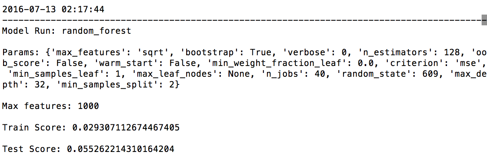
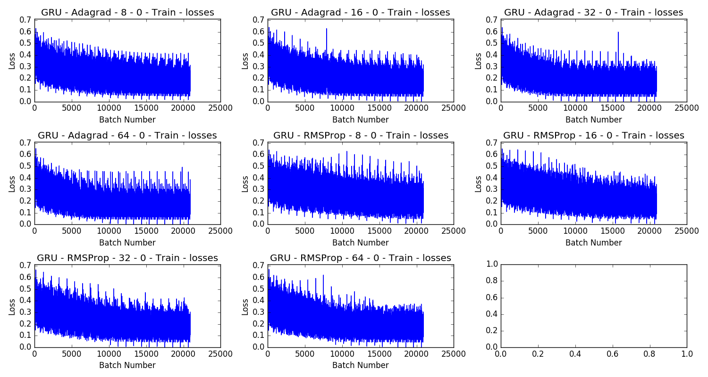
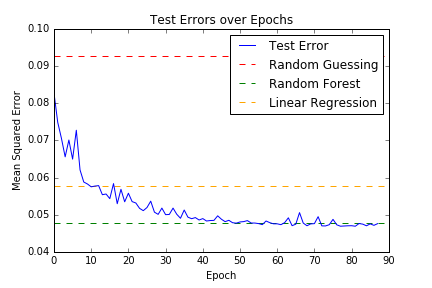
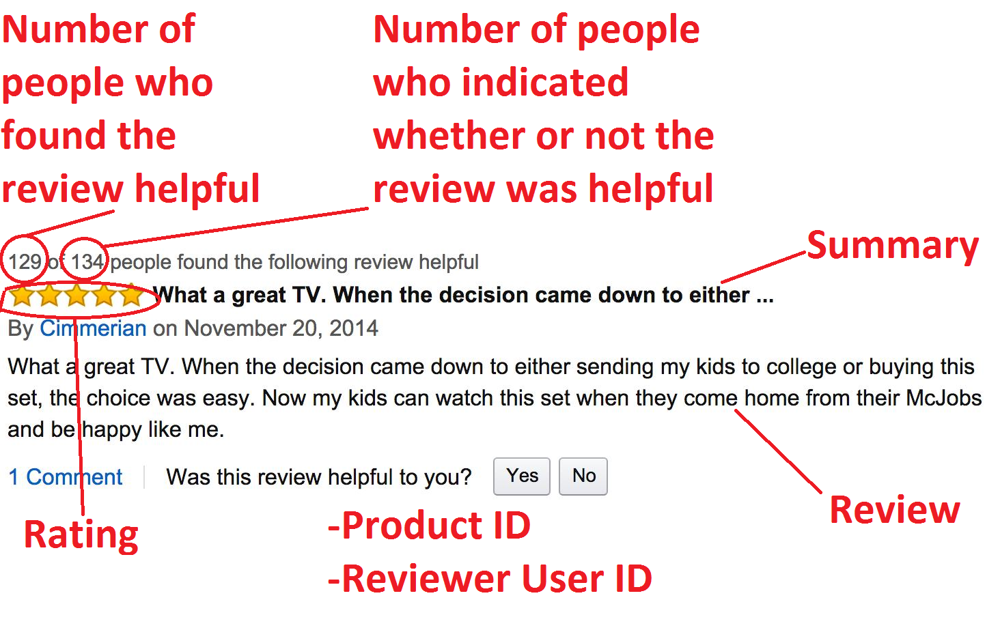

## Model goals

My goals were to fit simplistic models to determine if: 

a.) More than 100 words would help predict whether or not a particular review had a high helpfulness ratio.  
b.) Giving a model information about the syntactical structure of the review (word order) would help predict whether or not a particular review had a high helpfulness ratio. 

Given that the target was the helpfulness ratio, which is continuous (albeit bound between 0 and 1), this problem was treated as a regression problem. Statistically speaking, running a beta generalized linear model would ensure that the model doesn't output predictions outside of the 0-1 range in the most appropriate way (without something like clipping), but with the sophistication of models used below this turns out not to be an issue. 

I chose to fit regression based models using mean squared error as the loss metric - this fits nicely into the framework of predicting a continuous value between 0 and 1.
Compared to something like mean absolute value, it also allows the targeting of those observations that might be considered to be outliers (e.g. the small amount of reviews with low helpfulness ratios). 

## Model training

To keep it simple and to be able to iterate relatively quickly, I chose to fit a linear regression (primarily used as a baseline) as well as a random forest regressor to explore (a), and a simplistic recurrent neural network to explore (b). I set up code for these problems in such a way that I could simply run `bash`/`python` scripts to grid search over different parameter combinations for linear regression (largely the amount of regularization) and random forest models, as well as different model architectures for recurrent neural networks. The code in `non_net_models.py` allows for the former, and in `keras_model.py` the latter (using `Keras` allowed me to very quickly build up a neural network).

I carefully monitored the results of model runs through [log files](https://github.com/sallamander/review-analysis/blob/master/review_analysis/models/non_net_models.py#L103-L129) and [plots of training/testing errors](https://github.com/sallamander/review-analysis/blob/master/review_analysis/viz/model_eval.py#L6-L103). For the linear regression and random forest models, I would keep track of the max number of features (corpus words) that were included, the model parameters, and the train/test scores. The output of one of those log files would look something like the following (viewed in the terminal):  

The train/test error plots were generated for the neural network runs, and those would look something like the following: 

After setting up all of the code and testing to make sure that it would run correctly, I took it to the cloud (AWS) and started running models. For the linear regression and random forest models, I would simply perform a couple of grid searches over a given number of features (top words) in the tf-idf. For the recurrent neural network, I first began by ensuring that I could overfit to a small subset of my data, and then all of my data. At that point, I started iterating over different regularization options, trying to find the network architecture that would generalize most effectively. 

To ensure that I was choosing the model of each type that was generalizing most  effectively, I split the data into a 80/20 train/test split, and was careful to use the same split across all runs. 

## Modeling Results (Regression)

At the end of the day, I found that a recurrent neural network architecture was able to generalize most effectively. The random forest regressor was not far behind in terms of the test error! Each of the models performed better than intelligent random guessing, which I considered to correspond to taking the mean of the training set and using that as the prediction for every observation in the test set. The training and testing error from intelligent random guessing, as well as each of the trained models is, as follows: 

<table align="left">
  <tr>
    <td>Model</td>
    <td>Training Error</td>
    <td>Test Error</td>
  </tr>
  <tr>
    <td>Intellegent Random Guessing</td>
    <td>0.0912</td>
    <td>0.0926</td>
  </tr>
  <tr>
    <td>Linear Regression</td>
    <td>0.0496</td>
    <td>0.0577</td>
  </tr>
  <tr>
    <td>Random Forest Regression</td>
    <td>0.0065</td>
    <td>0.0479</td>
  </tr>
  <tr>
    <td>Recurrent Neural Network</td>
    <td>0.0392</td>
    <td>0.0470</td>
  </tr>
</table>

 
For the non-neural network models, it is worth noting the effects of additional features in the tf-idf matrix:  

<table align="center">
  <tr>
    <td>Num. Features</td>
    <td align="center" colspan="4">Model</td>
  </tr>
  <tr>
    <td></td>
    <td colspan="2">Linear Regression</td>
    <td colspan="2">Random Forest Regression</td>
  </tr>
  <tr>
    <td></td>
    <td align="center">Train</td>
    <td align="center">Test</td>
    <td align="center">Train</td>
    <td align="center">Test</td>
  </tr>
  <tr>
    <td align="center">1000</td>
    <td>0.0615</td>
    <td>0.0647</td>
    <td align="center">0.0065</td>
    <td align="center">0.0479</td>
  </tr>
   <tr>
    <td align="center">2000</td>
    <td>0.0558</td>
    <td>0.0613</td>
    <td align="center">0.0064</td>
    <td align="center">0.0479</td>
  </tr>
  <tr>
    <td align="center">3000</td>
    <td>0.0526</td>
    <td>0.0594</td>
    <td align="center">0.0065</td>
    <td align="center">0.0479</td>
  </tr>
  <tr>
    <td align="center">4000</td>
    <td>0.0509</td>
    <td>0.0583</td>
    <td align="center">0.0065</td>
    <td align="center">0.0479</td>
  </tr>
  <tr>
    <td align="center">5000</td>
    <td>0.0496</td>
    <td>0.0577</td>
    <td align="center">0.0065</td>
    <td align="center">0.0479</td>
  </tr>
</table>

Each of these models certainly has their drawbacks...

Because linear regression and the random forest regressor were fit on tf-idf matrices, they weren't able to take into account word order, or word similarity. They were instead restricted to trying to find similarity between entire documents (where documents are reviews). Clearly there is signal there, but it'd be nice if we could get even more, and also avoid overfitting (especially for the random forest). A way to potentially combat both of these would be to try using something like `doc2vec/paragraph2vec` from [gensim](https://radimrehurek.com/gensim/). With this, we could  embed each review into a lower dimensional space than the 1000 dimensional vector that each one is represented as in the tf-idf. These models still won't be able to account for word order or individual word similarity, but that is going to be unavoidable in using these models. They are, however, going to benefit from being able to include global statistics from the entirety of each document across the whole corpus. 

With a recurrent network, we'll be able to take into account word order as well as word similarity. However, this will be at the cost of getting a more localized view of our input review, as well as having to be very careful to avoid overfitting. Recurrent networks are also able to scan over an entire document (here a review), and with more sophisticated units like the LSTM and GRU, readily able to backpropogate error and learn. However, in the current model, the entire review was encoded into a single state vector before being interpreted and used for prediction. With a more sophisticated architecture (for example, an architecture with an attention based decoder), we could train our network using multiple state vectors, allowing it to hone in on which part of each review was most important.  

Given these results, if we were to continue using only the text, I think a good set of next steps would be to continue working on a recurrent neural network, but with a more sophisticated architecture like an attention based model. Simply building a larger model would be unlikely to improve results substantially, as the network is already able to overfit to the full training data set. We instead need a model that will generalize, and an attention based model should help. 

## Modeling Results (Classification)

To gain more insight into our model, we can imagine trying to classify documents as helpful or unhelpful based off of whether or not their helpfulness ratio is greater than 0.5. If we do that, we obtain the following confusion matrix: 

<table align="center">
  <tr>
    <td></td>
    <td align="center" colspan="3">Actual</td>
  </tr>
  <tr>
    <td></td>
    <td></td>
    <td align="center">True</td>
    <td align="center">False</td>
  </tr>
  <tr>
      <td rowspan="2">Predicted</td>
      <td align="center"> True</td>
      <td align="center"> 5,289 (True Positives)</td>
      <td align="center"> 1,467 (False Positives)</td>
  </tr>
  <tr>
      <td align="center">False</td>
      <td align="center"> 847 (False Negatives)</td>
      <td align="center"> 225 (True Negatives)</td>
  </tr>
</table>

  

All in all, this is a 70.4% accuracy rate, which is less than the 78.4% that intelligent random guessing would achieve. This isn't terribly surprising, though, given that this model was trained in a regression setting, where the model was minimizing mean squared error. In a true classification setting, the model would have been able to focus more on the ~20% of unhelpful reviews that it didn't start out predicting correctly, as opposed to having to try to fit to every single observation. In fact, if we train it in a classification setting (as I did just to check out the results), we'd see that we can get accuracies upwards of 87%.  

In addition to a low accuracy rate, it's also not encouraging to see that few true negatives, especially given that we probably want to be able to correctly predict which reviews are unhelpful. However, it's not unexpected given the high proportion of helpful reviews (79.8% of the dataset). If we actually look at the raw text for a couple of observations in each cell of the confusion matrix, we can dive into the results a little bit more.

| | Raw Review Text | True Helpfulness | Predicted Helpfulness | 
|---|-------------------------|---------------|--------------------|
|1| This strange food item is quite delicious.  I'd like to thank Dr. Snickers for a great contribution to our wonderful existence. | Yes | Yes |
|2| I am not a great chef, but I can follow directions.  I have gotten good results from my bread machine with plain white bread (on the basic setting with light crust), but I wanted something more interesting.  When I saw the reviews for the Prepared Pantry breads, I ordered several, including this english muffin bread mix.  When the directions said use a thermometer", I listened.  I used a meat thermometer (which worked just fine) and made sure the water was within a few degrees of 80.The bread came out perfectly (again on the basic setting with the light crust).  When I went back to write this review, I looked at the picture posted with this mix, and my bread came out exactly the same (after being sliced and toasted for about four minutes).  I am very satisfied with this product, and am looking forward to testing the other mixes I bought, including Black Russian and two diffrent cinnamon breads.  I would definitely recommend this bread! | Yes | Yes |
|3| This stuff tastes great, but coconut oil is extremely high in trans-fat...the stuff that sticks to your aeteries... | No | Yes | 
|4| I absolutely love this mustard - hands down my favorite. BUT - almost $10 for shipping. That is JUST RIDUCULOUS and a total rip-off. Would NEVER spend that kind of money for a jar of mustard, no matter how amazing it is. | No | Yes | 
|5| This "chili" is absolutely gross.  It has a sickly sweet flavor that reminds me of vomit, and makes your breath smell like dog food, even after brushing your teeth.  Trust me.  The only thing that can make eating it bearable is to add salt, which is fine for me but not for some.  I also add cayenne and crushed red and black pepper.  I will not reorder.  Can anyone produce healthy food that actually tastes good? | No | No | 
|6| I never used this type of coconut oil before. I'm not crazy about it. I would not recommend. | No | No | 
|7| Had a hard time finding this product. Looked on amazon and there it was.  Bought all that was there. | No | No | 
|8| Check out the sugar content before you buy!  27 grams/box - the same amount that's in a 12 oz. can of Coke!  This is ridiculously high for something that you think is going to be healthy! | Yes | No |
|9| because it isn't bacon.  It tastes like Baco's, which don't taste like bacon.  I fail to understand how anyone who really loves bacon can be satisfied with an imitation. | Yes | No |

The first two cases above are cases of **True Positives**, the second two **False Positives**, the next three **True Negatives**, and the last two **False Negatives**. It's certainly possible to look at the predicted versus actual helpfulness for these reviews (as well as others) and think that these are highly opinionated (and they most certainly are). But, in looking closely there are a few things that we can learn.  

In general, it appears that if the network found anything positive, it predicted the review to be helpful (e.g. `1-4`). This was regardless of whether or not the following text was pretty negative, as was the case in `3-4`. While the network picked up on the positive sentiment and from that predicted that it was a helpful review, a human reader was able to discern that those reviews didn't actually contain anything useful. They simply stated a positive attitude that didn't actually discuss the qualities of the product. This pattern appears to be present in the cases where the network predicted that a review was not helpful as well, but these unhelpfully predicted reviews also demonstrate other patterns that our net did (and didn't) learn, too. 

For the true negatives (`5-7`), we can see that the net didn't see any positive sentiment, and from that perspective was probably more likely to predict those reviews to be unhelpful. From looking at (`6-7`), though, we can also see that the network picked up on a review for the most part not having any relevant information in terms of product quality. Neither `6-7` really discuss the attributes of the product. `6` simply states they didn't like it (which isn't helpful in figuring out why a product isn't good), and `7` doesn't discuss product quality at all. For the false negatives (`8-9`), we can learn that the network would probably benefit from knowing what kind of product this was. Without knowing exactly what product these two reviews correspond to, it appears as if these two reviews might not be that helpful. They are not positive, to say the least, and even border on negative. But, if we knew that product `8` corresponded to a product that is heavily marketed as being a healthy alternative of some sugary cereal and that product `9` corresponded to a product marketed as being a healthy yet tasty bacon equivalent, then we'd have a good sense that these are actually helpful (despite them being negative). This is something that is probably easy for a human to pick up, but difficult for a neural network.  

## Moving forward 

Given the results of the model, I think there are a number of ways to improve it moving forward. As previously mentioned, I think that a more sophisticated architecture would help - I believe that an attention based decoder in the recurrent net would allow the network to more appropriately pick up which parts of the reviews it should be paying attention to. 

After examining a good number of cases where the model predicted both correctly and incorrectly (a couple of which were shown above), I think that additional data could bolster the model quite a bit, and possibly more so than a better network architecture. Certainly, a larger corpus of reviews would be helpful - this would help the network be able to pick up where an initial positive sentiment doesn't necessarily represent a helpful review (especially when followed entirely by negativity). These reviews could be from any kind of item on Amazon. 

In addition, knowledge of the actual product would also be beneficial, and knowledge of what users are looking for in that product. In fact, if I were Jeff Bezos, I would use all of the information I had for every user and every product to help determine whether a review was helpful. As the picture below (taken from [here](http://blog.nycdatascience.com/student-works/amazon-fine-foods-visualization/)) shows, there are loads of factors that go into a user voting on a review and deciding whether it is helpful or not...

For example... how many other people have rated that review so far? Did the majority find it helpful (and do I want to be that one person who didn't find it helpful)? How many other products has that user rated? How did I end up finding that review - what was I searching for, and is that review even relevant for me, or am I infuriated that this search has turned me towards an entirely irrelevant product and review? The list goes on and on... 

So, if I'm Jeff Bezos and my one priority is determining which reviews on my site are helpful, I'm using everything in my database. In addition to using everything that I have about each review (who wrote it, it's actual content, it's product information), I'm also using the information about how each particular user that ended up voting on a review ended up clicking through to that review, what reviews they've looked at and voted on in the past, what reviews they have written themselves, what products they tend to look at, etc. 

I would incorporate this information into the model by generating a couple of different aggregate metrics, the two most important of which I think would be the following: 

1. An overall user score - this would help determine not only if a given user tends to write helpful reviews, but also if their votes are trustworthy and should have a high weight associated with them. I imagine this being calculated somewhat similarly to how crowd-sourcing websites generate their user-trustworthiness scores, where they are built up over time. I think that this would be the most beneficial. 
2. An overall product score - this would help determine if that product is of a type that typically gets helpful reviews, is of a type that typically gets a pretty wide variety of reviews, etc. I imagine this being calculated by performing some kind of clustering on products based off of their similarities, and then examining the aggregate review scores for each cluster. 
