## Exploratory Data Analysis

Given the end goal of using review text to predict the helpfulness ratio, EDA largely consisted of looking at the distribution of helpfulness ratio, as well as visualizing
the top words for different bins of the helpfulness ratio. 

In terms of the data, some general statistics are as follows: 

```
Total number of reviews: 568,454
Total number of users: 256,059
Total number of products: 74,258

Mean helpfulness votes: 2.23 
Mean helpfulness ratio: 0.777
```

The overall distribution of votes on reviews is heavily left skewed, as roughly half of the original reviews had no votes denoting whether or not it was helpful:


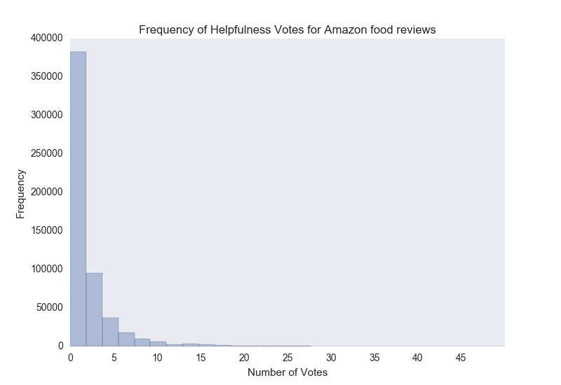

The helpfulness ratio was itself calculated from the raw data (568,454 obs) as the number of votes denoting that a review was helpful divided by the total number of votes. Reviews that did not have any votes (270,052 obs) were filtered from the dataset, as were reviews that had a helpfulness ratio greater than 1 (2 obs). This left 298,402 observations, with a heavily right skewed distribution of the helpfulness ratio: 


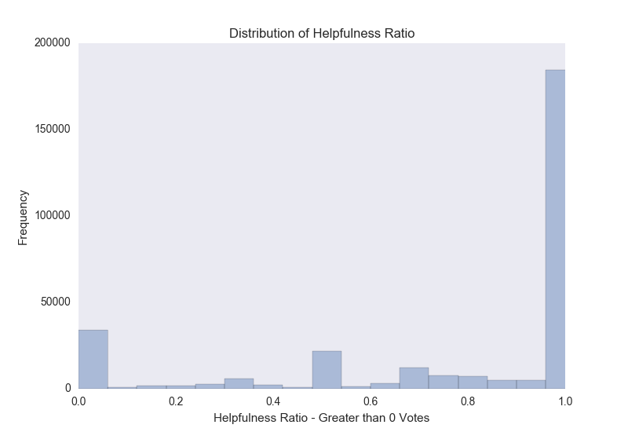
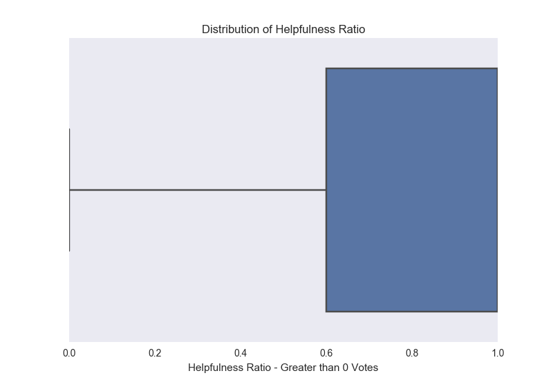

Similar to [related projects](http://cseweb.ucsd.edu/~jmcauley/cse255/reports/wi15/Shitij_Bhargava.pdf), reviews with too few votes were filtered out. In order to keep as many of the observations as possible while allowing the results to remain robust to these low-vote reviews, reviews with less than 5 votes were filtered out of the dataset. Further filtering involved filtering out reviews longer than 200 words - this decision was made to standardize the datasets that would be used across recurrent neural network models taking in raw text as well as non-neural network models taking in a tf-idf matrix. All in all, this left 41,838 observations, with the following distribution of helpfulness ratio:


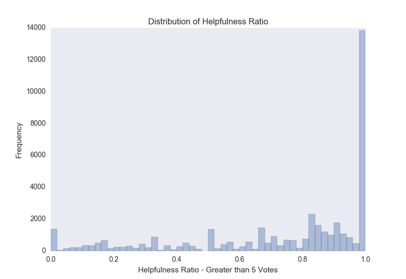
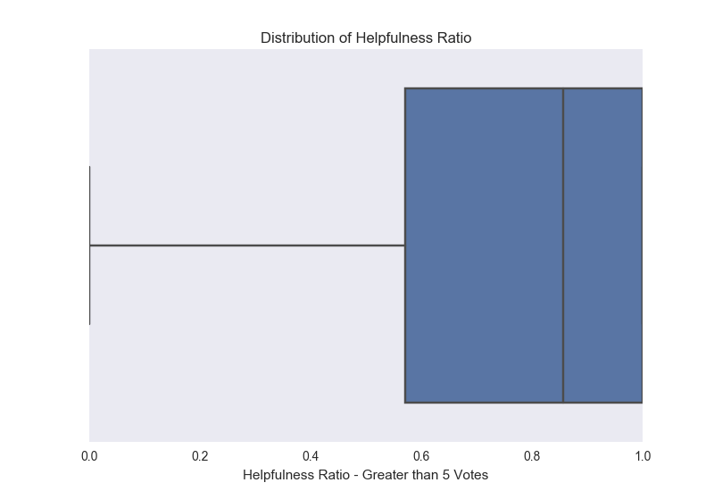

After filtering: 

```
Total number of reviews: 41,838 
Total number of users: 31,276 
Total number of products: 15,593 

Mean helpfulness votes: 14.53
Mean helpfulness ratio: 0.758
```

### t-SNE Plots

The next step in analyzing the data was to try to visualize the words for different types of reviews (helpful, unhelpful, and in the middle). I used a [Wikipedia + Gigawrd](https://github.com/3Top/word2vec-api) embedding to embed each individual word, but further reduced the dimensionality of each word vector using an implementation of [t-SNE](https://lvdmaaten.github.io/tsne/). This allowed me to view the top words in different types of reviews in a common vector space, and try to determine if certain words were used in certain reviews: 


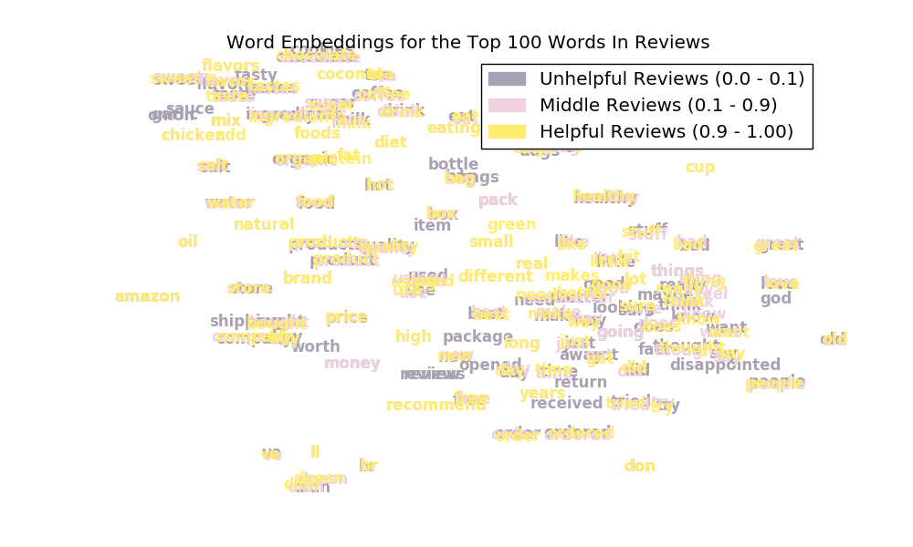

Here, reviews with a helpfulness ratio less than 0.10 were considered to be unhelpful, while those from 0.10 - 0.90 in the middle, and those greater than 0.90 helpful. Here, we can see heavy overlap of words, and no real clustering of certain words for certain types of reviews. There is unfortunately no clear pattern (unless we really force it), and changing our definition of unhelpful/in the middle/helpful reviews doesn't really change that...

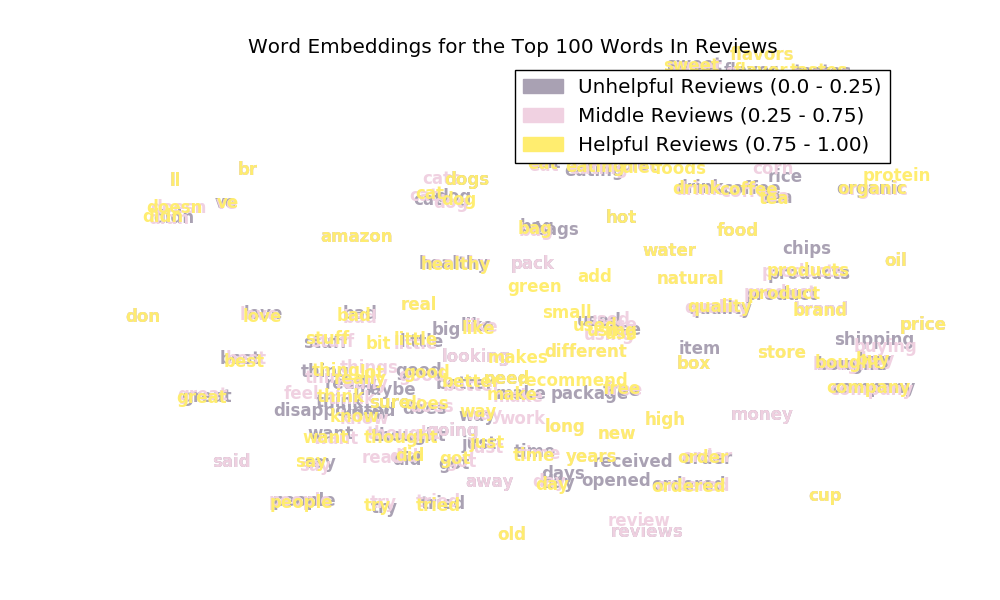
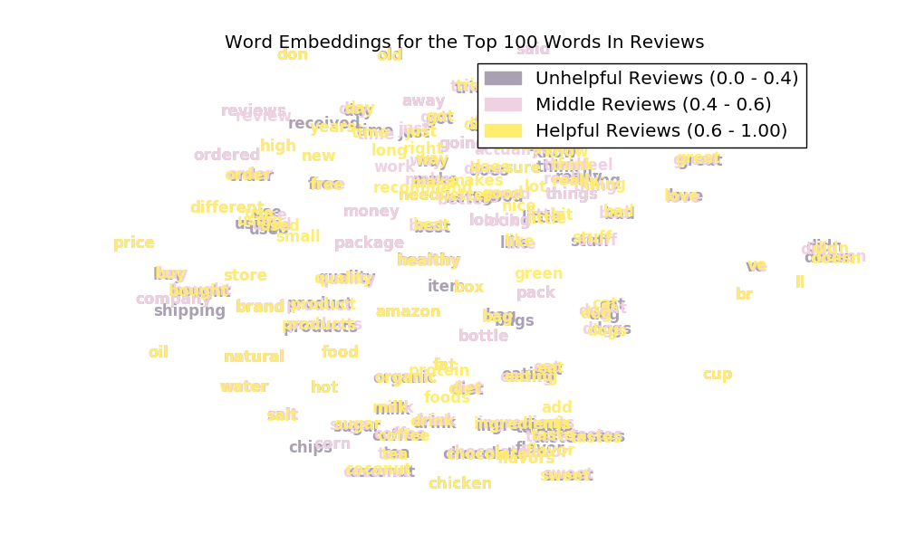

Looking at certain parts of speech, or the top 100-200, 200-300, etc. words doesn't seem to indicate that certain words are more prevalent than others in any given review type, either (plots look similar across different cutoffs for review types).

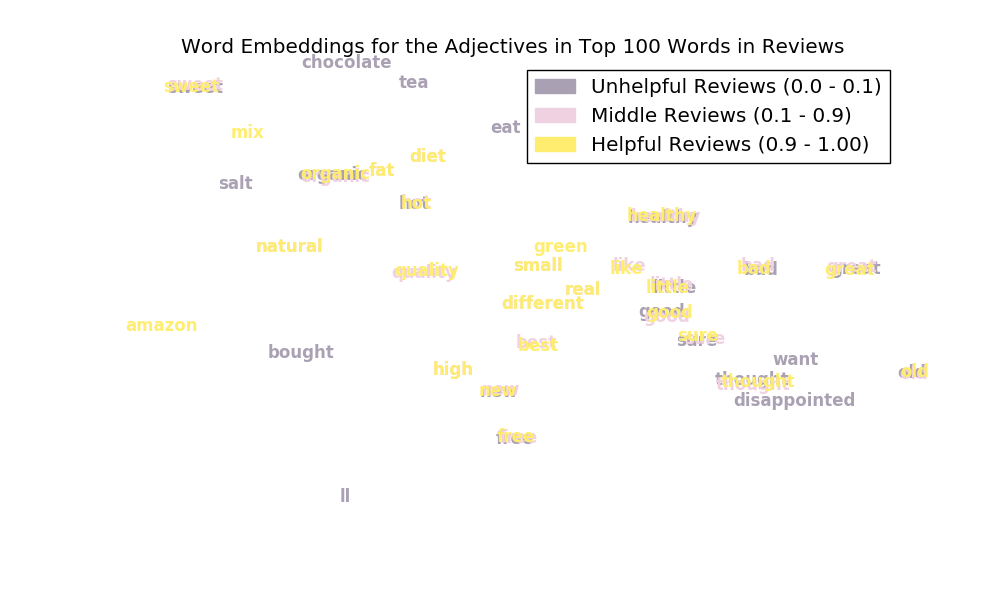
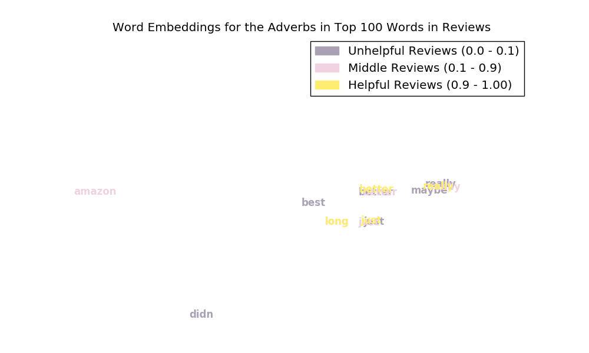
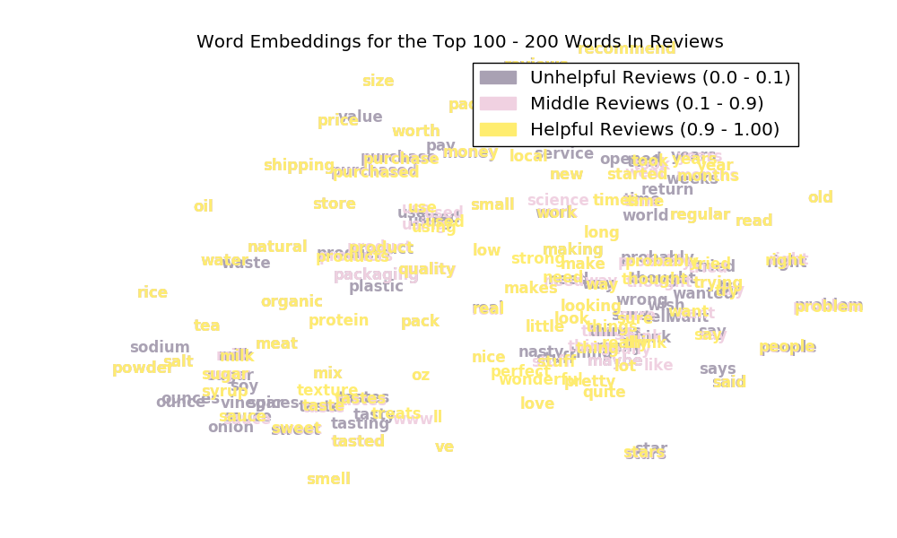
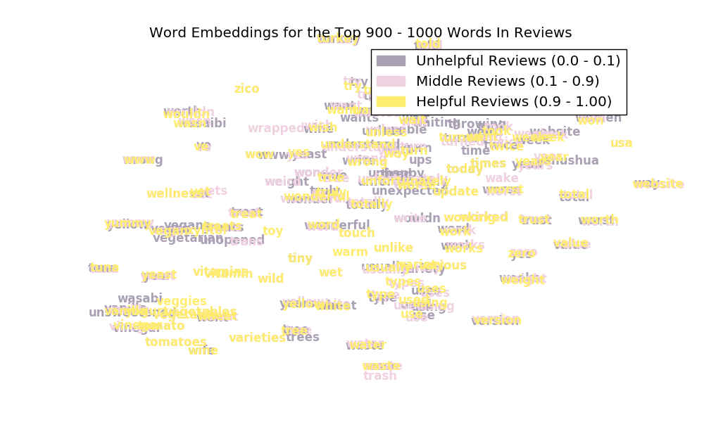

We might be able to see one or two things here that appear to be some signal, but there aren't really any clear patterns from just the top words alone. This suggests that for a model to learn, it will either need more than just one hundred words, or will need additional information in terms of the actual syntactical structure of the review (e.g. the order of the words). To test the former hypothesis, I chose to move forward fitting some simplistic models that could simply take in a large term-frequency, inverse document frequency (tf-idf) matrix. To test the latter, I chose to train a simplistic recurrent neural network. 
